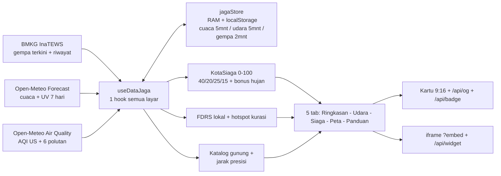
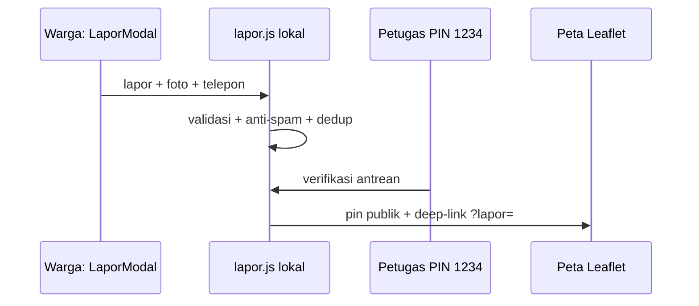

# JagaKota — Jaga Kota Bersama

> Skor **KotaSiaga** khas warga, udara berbahasa sehari-hari, dan panduan darurat 112 — dalam satu dasbor cepat untuk 515 kota Indonesia.


Live: **https://jagakota.vercel.app/** · PWA (pasang dari browser) · Mode offline via cache lokal.

---

## Tentang JagaKota

**JagaKota** adalah dasbor web mobile-first yang menerjemahkan data lingkungan ke bahasa warga. Fokus MVP di folder ini sederhana: buka aplikasi, pilih kota atau pakai GPS, langsung dapat satu angka **KotaSiaga 0–100**, status udara kata sehari-hari, dan saran aksi yang bisa dikerjakan hari ini.

Tidak perlu paham AQI, PM2.5, atau seismik. Semua angka teknis tetap ada untuk yang mau ngulik, tapi lapisan pertamanya selalu bahasa manusia: aman keluar atau tidak, perlu masker atau tidak, anak dan lansia bagaimana, ventilasi dibuka atau ditutup.

MVP yang benar-benar jalan di repo ini:

- Satu hook data `useDataJaga` untuk semua layar — cuaca + UV, udara, gempa, gunung, karhutla.
- Skor khas **KotaSiaga** + label udara **Segar / Lumayan / Pengap / Pekat** + saran aksi masker · olahraga · anak & lansia · ventilasi.
- Lima tab: **Ringkasan · Udara · Siaga · Peta · Panduan**.
- Peta Leaflet, panduan darurat 112 satu modal 4 tab, Lapor Warga local-first + sinkron Supabase opsional.
- Kartu cerita 9:16 (canvas), widget iframe + endpoint JSON, badge SVG, OG image, dan cache offline `jagaStore`.

---

## Cara kerja

Seluruh logika tinggal di satu hook data, label memakai bahasa warga, dan daftar kota disimpan sebagai tabel kompak:

| Bagian | Isi |
| :--- | :--- |
| Skor | **KotaSiaga 0–100** + bahasa warga (Segar/Lumayan/Pengap/Pekat) |
| Data | Satu hook **`useDataJaga`** (file `src/hooks/useDashboardData.js`) untuk semua layar |
| Kota | **Tabel kompak** `nama|prov|reg` + slug otomatis (~39 KB, `src/utils/cities.js`) |
| Cache | **`jagaStore`** alias `apiCache.js` — RAM + localStorage, TTL per jenis data + statistik hit/miss |
| Panduan | **Satu modal 4 tab**: Kontak · Gempa · Udara · Tsunami & UV |

Alur lengkap (bisa di-zoom di GitHub): [docs/architecture.md](./docs/architecture.md)



Alurnya: service ambil data → masuk `jagaStore` → dihitung `kotaScore.js` → disebar ke kartu, peta, grafik, share, dan widget.

### Alur Lapor Warga (local-first, cloud opsional)



Sinkron Supabase (`VITE_LAPOR_CLOUD=true`): tarik `reports_publik`/`antrean` → dorong max 20 → foto `report-photos` → hapus via RPC → broadcast realtime + polling 20dt. Detail: [docs/architecture.md](./docs/architecture.md#8-pipa-lapor-warga-local-first--sinkron-opsional).

---

## Cara baca skor KotaSiaga

Rumus di `src/utils/kotaScore.js` (`calculateKotaSiaga`): udara 40 · partikel PM2.5 20 · rasa panas 25 · UV 15. Bonus kecil saat hujan deras (udara tercuci).

- **75–100 Aman — Kota Terjaga** — gas keluar, buka ventilasi.
- **50–74 Waspada — Layak Bersyarat** — olahraga pagi/sore saja, sunscreen bila UV tinggi.
- **25–49 Siaga — Kurangi Aktivitas** — keluar seperlunya, masker bila AQI > 100.
- **0–24 Awas — Batasi Keluar** — masker N95, tutup ventilasi, tunda aktivitas luar.

Paparan harian memakai acuan WHO (±12 µg/m³ ≈ 1 kretek). Setiap skor ditemani **saran aksi**: masker · olahraga · anak & lansia · ventilasi.

---

## Sumber data (jujur sesuai kode)

- **BMKG InaTEWS (live)** — `src/services/bmkg.js`: `autogempa.json` + `gempaterkini.json` + shakemap. Timeout 6 detik + fallback statis.
- **Open-Meteo Forecast (live, bukan BMKG)** — `src/services/weather.js`: suhu, feels-like, kelembapan, angin, tekanan, hujan, UV, prakiraan 7 hari.
- **Open-Meteo Air Quality + Copernicus (live)** — `src/services/airQuality.js`: AQI US, PM2.5, PM10, CO, NO₂, SO₂, O₃, debu + hourly 24 jam.
- **PVMBG / MAGMA (katalog lokal, bukan live API)** — `src/utils/volcanoes.js`: status 4 level + radius bahaya + jarak Haversine ke gunung terdekat.
- **Karhutla (FDRS hitungan lokal + katalog hotspot)** — `src/services/karhutla.js` + `src/utils/karhutla.js`: fungsi live FIRMS tersedia tapi butuh key, default tampil hitungan FDRS dari cuaca + hotspot terdekat lokal. Label SiPongi+/FIRMS dipakai sebagai referensi sumber.

Tidak ada kunci rahasia di klien. Saat jaringan mati, aplikasi menampilkan cache terakhir dan menandainya *Mode Offline*.

---

## Fitur detail per layar

### 1. Ringkasan — satu angka untuk keputusan cepat

- Kartu `EcoHealthCard.jsx`: skor KotaSiaga + jarum status + paparan kretek + 4 chip saran aksi.
- Cuaca sekilas (`WeatherCard.jsx`): suhu, feels-like, kelembapan, angin.
- Grafik AQI per jam (`AqiChart.jsx`) + spanduk otomatis `SpandukAwas` saat AQI > 150 atau gempa M ≥ 5.5.
- Ticker status + banner PWA / offline / GPS + pull-to-refresh + getar pola `getarJaga`.

### 2. Udara — polutan lengkap tanpa bikin pusing

- `AqiCard.jsx`: AQI US + label warga (Segar / Lumayan / Pengap Sensitif / Pengap / Pekat).
- `KimiaCard.jsx`: 6 polutan PM2.5, PM10, CO, NO₂, SO₂, O₃.
- `UvCard.jsx`: UV kini + per jam + anjuran sunscreen.
- `WeatherForecastChart.jsx`: prakiraan 7 hari (suhu min/max, hujan, cuaca).

### 3. Siaga — gempa, gunung, karhutla dalam satu tempat

- `EarthquakeCard.jsx`: gempa terbaru InaTEWS + 15 riwayat + tombol fokus ke peta + status potensi tsunami + MMI.
- `VolcanoCard.jsx` + `VolcanoListModal.jsx`: gunung terdekat otomatis + zona bahaya/waspada + daftar + filter status PVMBG.
- `KarhutlaCard.jsx` + `KarhutlaListModal.jsx`: level FDRS (Aman/Sedang/Rawan/Ekstrem) + hotspot terdekat + penanda kabut vs asap beracun (korelasi jarak api + lonjakan PM2.5).

### 4. Peta — Leaflet multi-layer

- `IndonesiaMap.jsx`: pin kota (radius 8 km & 25 km), titik gunung + radius bahaya, titik api karhutla, lingkaran gempa sesuai magnitudo, pin Lapor Warga.
- Cari 500+ kota + GPS (`CitySearchModal.jsx`), deep-link `?city=slug` dan `?lapor=id`.

### 5. Panduan — darurat 112 tanpa scroll bingung

- `EmergencyGuideModal.jsx`: tombol Call 112 + kontak Basarnas 115, Ambulans 118/119, Damkar 113, Polisi 110, PLN 123.
- Protokol ringkas: gempa (drop-cover-hold), tsunami, erupsi & hujan abu, banjir, polusi ekstrem.

### Fitur warga: lapor, bagikan, sematkan

- **Lapor Warga** (`LaporModal.jsx`, `DaftarLaporModal.jsx`, `PetugasModal.jsx`): local-first, seed 3 demo, moderasi PIN demo `1234`. Sinkron Supabase (`utils/sinkron.js` + `supabase/schema.sql`) hanya aktif bila `VITE_LAPOR_CLOUD=true`, default demo juri 100% lokal.
- **Kartu cerita 9:16** (`ShareCardModal.jsx`): canvas skor + AQI + cuaca + gempa + FDRS, unduh PNG + Web Share API ke WA/IG Story/X/Telegram.
- **Embed & API ringan**: `EmbedWidgetModal.jsx` (salin iframe, `?embed=true` via `WidgetEmbedView.jsx`), `GET /api/widget?kota=&lat=&lon=` buat KWGT/Tasker (CORS `*`), `GET /api/badge` SVG, `GET /api/og?kota&aqi&status&...` OG image 1200×630.
- **PWA**: `manifest.webmanifest` (standalone, 192/512/maskable), `sw.js` didaftarkan hanya di produksi, prompt pasang (`InstallGuideModal.jsx`), onboarding peran warga/petugas (`OnboardingIntro.jsx`).

---

## Kinerja

| Bagian | Teknik di repo ini | Efek |
| :--- | :--- | :--- |
| State instan | Cache dulu, fetch kemudian di `useDataJaga` | Layar langsung kebuka, tidak bengong |
| Cache awet | `jagaStore` TTL: cuaca 5 mnt, udara 5 mnt, gempa 2 mnt | Buka ulang tetap cepat + ada statistik hit/miss |
| Bundle ramping | `manualChunks` Leaflet / Recharts / Icons / React di `vite.config.js` | Awal unduh kecil, peta & grafik dimuat saat dibuka |
| Anti macet | `AbortController` + timeout + fallback tiap service | BMKG lambat tidak bikin freeze |
| SEO & offline | Meta OG/Twitter dinamis + deteksi offline | Share WA/X berpreview, putus internet tetap kebaca |

---

## Tumpukan teknologi

- **Framework**: React 19 + Vite 8
- **Styling**: Tailwind 4 + CSS kustom (dark mode)
- **Peta**: Leaflet 1.9.4 + React-Leaflet 5 + OpenStreetMap
- **Grafik**: Recharts 3.10
- **Ikon**: Lucide React
- **Backend opsional**: Supabase (Lapor Warga tahap 2)
- **Serverless**: Vercel Edge (`api/og.jsx`, `api/widget.js`, `api/badge.js`) + Analytics

---

## Menjalankan lokal

```bash
npm install
npm run dev      # http://localhost:3000
npm run build    # cek produksi
```

Butuh backend Lapor? Salin `.env.example` ke `.env`, isi `VITE_SUPABASE_URL` + `VITE_SUPABASE_ANON_KEY` dari dashboard Supabase, set `VITE_LAPOR_CLOUD=true`. Untuk demo juri biarkan `false`.

Struktur penting: `src/hooks/useDashboardData.js` (ekspor `useDataJaga`, otak data), `src/utils/kotaScore.js` (rumus skor), `src/utils/apiCache.js` (alias `jagaStore`), `src/utils/cities.js` (tabel kota), `src/components/shell/AppShell.jsx` (kerangka tab), `src/services/` (bmkg, weather, airQuality, karhutla, volcano).

---

## Atribusi AI

Dibangun oleh Fiscalll2 dengan bantuan beberapa AI agent harness (dipakai manual, tanpa integrasi GitHub) untuk scaffolding, integrasi API, dan refactoring. Semua output diverifikasi dan diuji manual. Lihat riwayat commit untuk jejak perubahan.

---

## Lisensi

[MIT License](LICENSE) — bebas dipakai untuk publik, riset, dan kemanusiaan.
