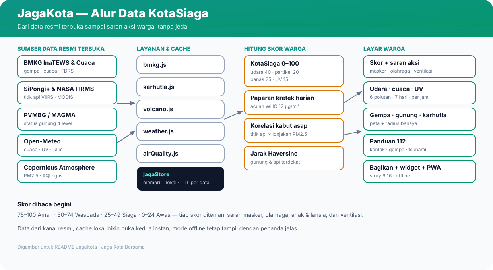

# JagaKota v2 — Jaga Kota Bersama

> Skor **KotaSiaga** khas warga, udara berbahasa sehari-hari, dan panduan darurat 112 — dalam satu dasbor cepat untuk 515 kota Indonesia.


Live: **https://jagakota.vercel.app/** · PWA (pasang dari browser) · Mode offline via cache lokal.

---

## Kenapa v2 ditulis ulang?

Generasi sebelumnya menumpuk seluruh logika di satu komponen raksasa dan memakai label kaku terjemahan standar. v2 memisahkannya:

| Dulu | Sekarang |
| :--- | :--- |
| Skor generik + label EPA (Baik/Sedang/...) | **KotaSiaga 0–100** + bahasa warga (Segar/Lumayan/Pengap/Pekat) |
| Fetch + cache + state tercampur di `App` | Satu hook **`useDashboardData`** untuk semua layar |
| Daftar kota 72 KB objek JSON | **Tabel kompak** `nama|prov|reg` + slug otomatis (~39 KB) |
| Cache satu TTL untuk semua | **`jagaStore v2`** — TTL per jenis data + statistik hit/miss |
| Panduan darurat satu halaman panjang | **4 tab**: Kontak · Gempa · Udara · Tsunami & UV |



---

## Cara baca skor KotaSiaga

Bobot: udara 40 · partikel PM2.5 20 · rasa panas 25 · UV 15. Bonus kecil saat hujan deras (udara tercuci).

- **75–100 Aman** — gas keluar, buka ventilasi.
- **50–74 Waspada** — olahraga pagi/sore saja, sunscreen bila UV tinggi.
- **25–49 Siaga** — keluar seperlunya, masker bila AQI > 100.
- **0–24 Awas** — masker N95, tutup ventilasi, tunda aktivitas luar.

Paparan harian memakai acuan WHO (±12 µg/m³ ≈ 1 kretek), bukan angka rokok generik. Setiap skor ditemani **saran aksi**: masker · olahraga · anak & lansia · ventilasi.

---

## Sumber data (semua terbuka & resmi)

- **BMKG** — autogempa & gempaterkini InaTEWS, prakiraan cuaca, FDRS karhutla.
- **PVMBG / MAGMA Indonesia** — status 4 level gunung api + radius bahaya.
- **KLHK SiPongi+ & NASA FIRMS** — titik panas VIIRS/MODIS se-Indonesia.
- **Open-Meteo + Copernicus** — AQI US, PM2.5/PM10, CO, NO₂, SO₂, O₃, UV.

Tidak ada kunci API rahasia di sisi klien. Saat jaringan mati, aplikasi menampilkan cache terakhir dan menandainya *Mode Offline*.

---

## Navigasi aplikasi

Lima tab di sidebar (desktop) / bar bawah (HP): **Ringkasan · Udara · Siaga · Peta · Panduan**.

- *Ringkasan* — skor + udara + cuaca sekilas + grafik AQI.
- *Udara* — 6 polutan + prakiraan 7 hari + UV per jam.
- *Siaga* — gempa terkini + gunung terdekat + karhutla & kabut asap.
- *Peta* — Leaflet: kota, gunung, titik api, lingkaran gempa.
- *Panduan* — tombol darurat 112 + protokol BNPB/BMKG/Kemenkes.

Fitur warga: kartu cerita 9:16 (canvas, siap WhatsApp/IG Story), widget semat iframe + endpoint `/api/widget-data` buat KWGT/Tasker, dan prompt pasang PWA.

---

## Menjalankan lokal

```bash
npm install
npm run dev      # http://localhost:3000
npm run build    # cek produksi
```

Struktur penting: `src/hooks/useDashboardData.js` (otak data), `src/utils/kotaScore.js` (rumus skor), `src/utils/jagaStore` alias `apiCache.js` (cache), `src/utils/cities.js` (tabel kota), `src/components/shell/AppShell.jsx` (kerangka tab).

---

## Atribusi

JagaKota v2 dikembangkan dari [**Sekitarku**](https://github.com/anasysuf/sekitarku) (MIT) dengan perombakan besar: arsitektur, rumus skor, bahasa antarmuka, dan sistem navigasi. Dibantu penulisan oleh **OpenCode**. Lihat `CHANGELOG.md` untuk riwayat per versi.

## Lisensi

[MIT License](LICENSE) — bebas dipakai untuk publik, riset, dan kemanusiaan.
