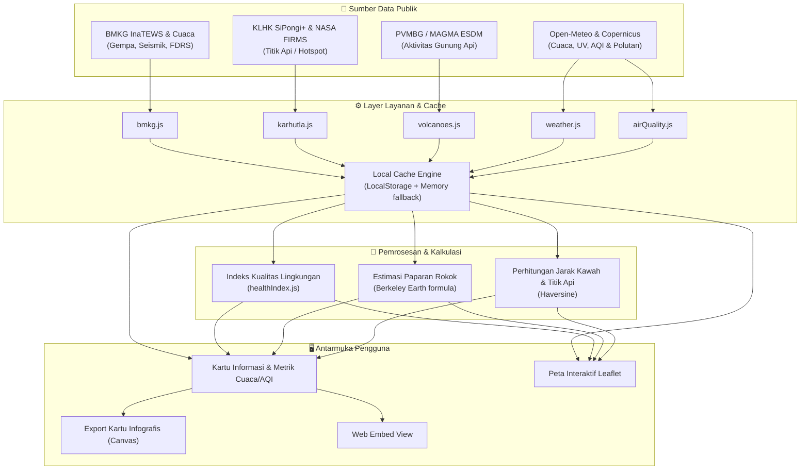

# 🌿 JagaKota — Dashboard Pantauan Lingkungan & Mitigasi Bencana Real-Time

Dashboard berbasis web (PWA) untuk memantau kualitas udara, cuaca, gempa bumi, titik panas karhutla, dan aktivitas gunung berapi di Indonesia secara terpadu.

[](https://sekitarku.vercel.app)
[](package.json)
[](LICENSE)

---

## 📌 Tentang Proyek

Informasi terkait lingkungan dan potensi bencana di Indonesia sering kali tersebar di berbagai portal resmi yang terpisah. **JagaKota** menggabungkan data-data tersebut ke dalam satu antarmuka yang ringan, mudah dibaca, dan responsif baik di desktop maupun ponsel.

Aplikasi ini mengintegrasikan data terbuka dari beberapa lembaga:
- **BMKG**: Cuaca harian & prakiraan 7 hari, Indeks FDRS (kerawanan kebakaran hutan), serta sistem peringatan dini gempa bumi (*InaTEWS*).
- **PVMBG / MAGMA ESDM**: Status aktivitas gunung api aktif (Level I–IV), radius aman kawah, dan rekomendasi mitigasi.
- **KLHK SiPongi+ & NASA FIRMS**: Data sebaran titik panas (*hotspot*) kebakaran hutan dan lahan.
- **Open-Meteo & Copernicus**: Parameter kualitas udara (AQI, PM2.5, PM10, polutan gas) dan indeks radiasi UV.

---

## 🚀 Fitur Utama

- **Skor Kualitas Lingkungan & Rekomendasi Aktivitas**  
  Menggabungkan parameter kualitas udara, suhu, kelembapan, dan indeks radiasi UV menjadi skor 0–100 yang mudah dipahami, disertai saran untuk aktivitas luar ruangan (jogging, bersepeda, lansia/anak, dan ventilasi rumah).

- **Pantauan Kualitas Udara (AQI & Polutan Mikro)**  
  Menampilkan indeks standar US-EPA dan ISPU beserta rincian konsentrasi polutan (PM2.5, PM10, CO, NO₂, SO₂, O₃) serta grafik tren 24 jam. Terdapat juga estimasi konversi paparan partikulat udara harian terhadap hisapan rokok pasif (metode Berkeley Earth).

- **Deteksi Titik Api & Kabut Asap**  
  Pemantauan titik panas kebakaran hutan dari citra satelit dan indeks FDRS BMKG untuk membedakan antara kabut biasa (*mist/fog*) dan asap kebakaran (*wildfire haze*).

- **Status Gunung Berapi Terdekat**  
  Menghitung jarak otomatis dari lokasi pengguna ke kawah gunung api aktif terdekat menggunakan formula *Haversine*, lengkap dengan status peringatan resmi PVMBG dan radius steril.

- **Peringatan Dini Gempa Bumi BMKG**  
  Menampilkan informasi gempa bumi terkini lengkap dengan magnitudo, kedalaman, titik episentrum, status potensi tsunami, peta guncangan (*shakemap*), serta daftar riwayat gempa terbaru.

- **Peta Interaktif (Leaflet)**  
  Visualisasi geospasial dengan layer terpisah untuk memantau sebaran kota, kawah gunung aktif, titik api kebakaran hutan, dan pusat gempa secara bersamaan.

- **Generator Kartu Infografis & Share Cepat**  
  Menghasilkan gambar ringkasan laporan berformat vertikal (rasio 9:16) via HTML5 Canvas yang siap dibagikan langsung ke WhatsApp Status, Instagram Story, atau platform media sosial lainnya.

- **Widget & Panduan Darurat 112**  
  Menyediakan kode sematan (*embed iframe*) untuk website, serta panduan praktis tanggap darurat bencana (gempa, banjir, erupsi) dan direktori kontak instansi tanggap darurat.

---

## 🛠️ Aliran Data (Architecture)



---

## 💻 Menjalankan di Lokal (Local Development)

Pastikan kamu sudah menginstal **Node.js** (versi 18 ke atas) di komputermu.

1. **Clone repository ini:**
   ```bash
   git clone https://github.com/username-kamu/jagakota.git
   cd jagakota
   ```

2. **Install dependensi:**
   ```bash
   npm install
   ```

3. **Jalankan development server:**
   ```bash
   npm run dev
   ```
   Buka alamat yang muncul di terminal (biasanya `http://localhost:5173` atau `http://localhost:3000`) di browsermu.

4. **Build untuk produksi:**
   ```bash
   npm run build
   ```
   Hasil build siap deploy akan tersimpan di folder `dist/`.

---

## 📦 Teknologi yang Digunakan

- **Frontend Core**: [React 19](https://react.dev/), [Vite](https://vitejs.dev/)
- **Peta Interaktif**: [Leaflet](https://leafletjs.com/) & [React-Leaflet](https://react-leaflet.js.org/) (Tile OpenStreetMap)
- **Grafik & Visualisasi**: [Recharts](https://recharts.org/)
- **Ikon**: [Lucide React](https://lucide.dev/)
- **Styling**: Vanilla CSS (CSS Variables, tema Gelap & Terang, tanpa framework CSS berat)

---

## 📄 Lisensi

Proyek ini menggunakan lisensi [MIT](LICENSE). Terbuka untuk digunakan, dipelajari, maupun dikembangkan lebih lanjut.
