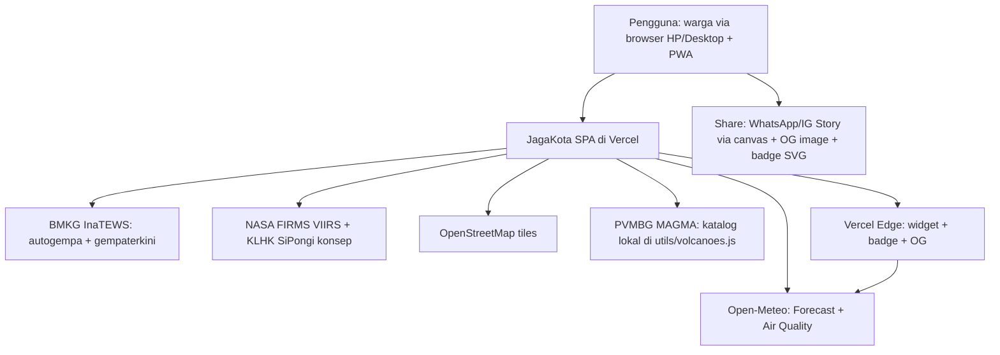
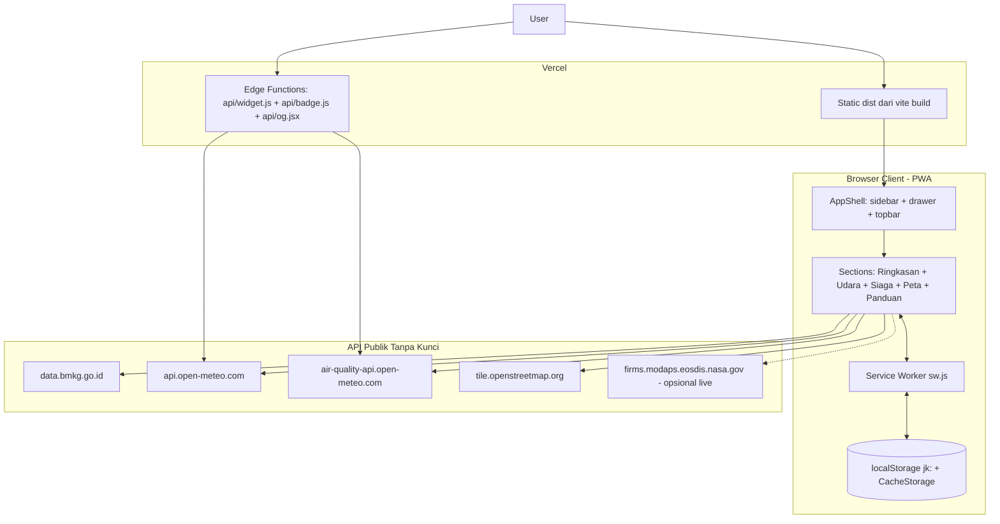
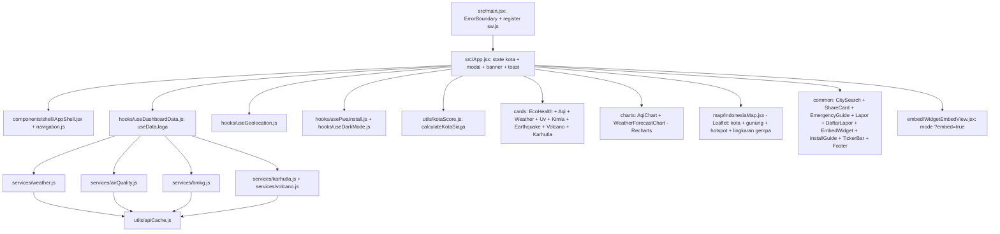
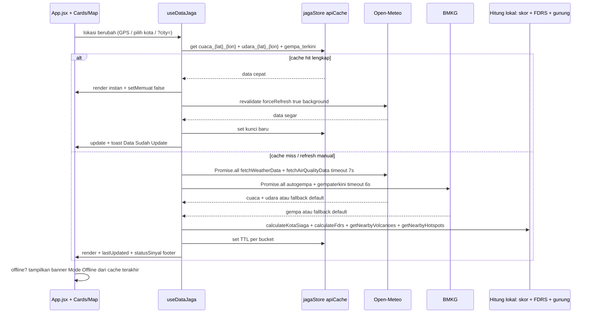
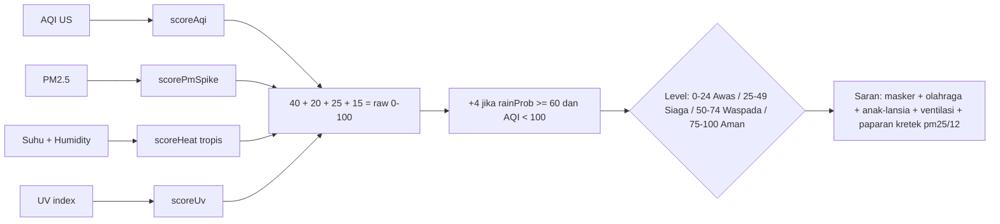
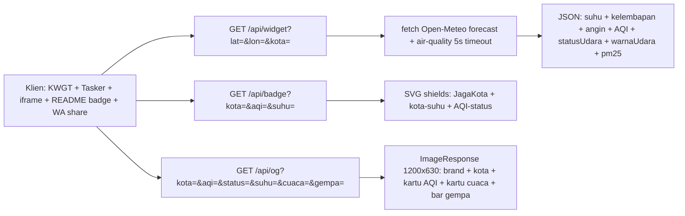
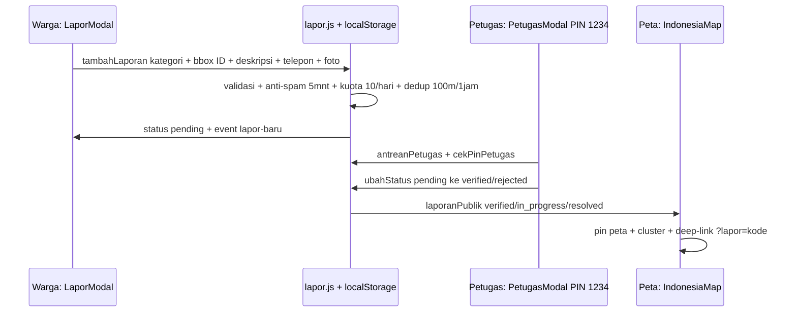
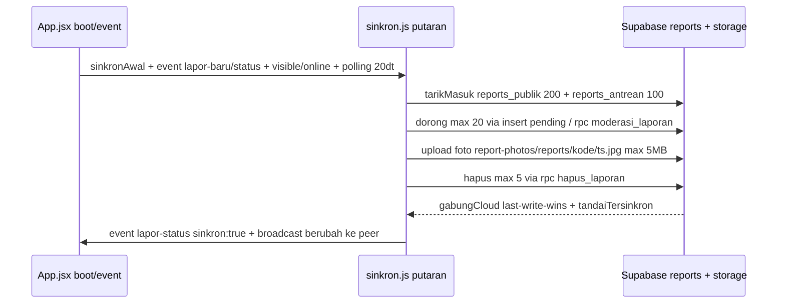

# Arsitektur Sistem JagaKota

> JagaKota — dasbor civic real-time: skor KotaSiaga, kualitas udara bahasa warga, cuaca, gempa, gunung api, karhutla, dan panduan darurat 112. SPA offline-first tanpa backend sendiri.

- Frontend: React 19 + Vite 8 + Tailwind 4 + React-Leaflet + Recharts
- Data: `src/hooks/useDashboardData.js` sebagai orkestrator tunggal
- Cache: `src/utils/apiCache.js` (`apiCache` / `jagaStore`) + `public/sw.js`
- Edge: `api/widget.js`, `api/badge.js`, `api/og.jsx` di Vercel Edge Runtime
- Deploy: Vercel static + `vercel.json` headers/CSP/rewrite SPA

## 1. Konteks Sistem (C4 Level 1)

Sumber resmi terdaftar satu pintu di `src/utils/sources.js`: BMKG, PVMBG Magma, NASA FIRMS, KLHK SiPongi+, Open-Meteo.

## 2. Kontainer dan Deployment

Detail deploy:

- `vite.config.js`: `manualChunks` memisah `vendor-leaflet`, `vendor-recharts`, `vendor-icons`, `vendor-react`.
- `vercel.json`: header keamanan `CSP`, `Permissions-Policy`, cache `assets/* immutable 1th`, `api/* max-age 120 s-maxage 600`, `sw.js + manifest` no-cache, rewrite SPA `/(api excluded) -> /index.html`.
- `index.html`: `dns-prefetch + preconnect` ke fonts, Open-Meteo, BMKG, OSM; OG tags menunjuk `/api/og`.
- `public/manifest.webmanifest`: standalone, icons 192/512 + maskable, widget `jagakota-widget -> /api/widget`.
- `public/sw.js`: install precache `/ + index.html + icons + manifest`; fetch: navigasi network-first fallback `index.html`, OSM tiles network-first, BMKG/Open-Meteo network-first, JS/CSS cache-first.

## 3. Komponen Frontend

Pemetaan file penting:

| Lapisan | File | Peran |
|---|---|---|
| Orkestrasi | `src/hooks/useDashboardData.js` | `muatKota`, `muatGempa`, `segarkanManual`, fast-path cache lalu revalidate |
| Cuaca | `src/services/weather.js` | fetch Open-Meteo, `calibrateWeatherCode`, fallback `getDefaultWeather` |
| Udara | `src/services/airQuality.js` | fetch Air Quality API, fallback `getDefaultAqi` |
| Gempa | `src/services/bmkg.js` | `autogempa.json` + `gempaterkini.json`, timeout 6s, fallback statis |
| Api darat | `src/services/karhutla.js`, `src/services/volcano.js` | FDRS lokal + hotspot kurasi, radius gunung via `utils/geo.js` |
| Skor | `src/utils/kotaScore.js` | bobot udara 40 / partikel 20 / panas 25 / UV 15 + bonus hujan |
| Kota | `src/utils/cities.js` | tabel kompak `nama|prov|reg` 515 kota + slug + `cariKota` |
| Cache | `src/utils/apiCache.js`, `public/sw.js` | dua lapis: RAM Map + localStorage + CacheStorage |

## 4. Alur Data Runtime (Sequence)

Kunci cache: `cuaca_{la}_{lo}`, `udara_{la}_{lo}`, `gempa_terkini`, `gempa_list`, `siaga_api_{la}_{lo}`, `gunung_{la}_{lo}` plus alias kompatibel `weather_*`, `aqi_*`, `bmkg_*`, `karhutla_*`, `volcano_*`.

TTL (`src/utils/apiCache.js`): `cuaca 5 mnt`, `udara 5 mnt`, `gempa 2 mnt`, default 10 mnt. Fallback quota darurat buang 15 entri `jk:` tertua saat `localStorage` penuh (bukan LRU murni). Statistik `hit/miss` tersedia di `apiCache.stats`.

## 5. Pipa Skor KotaSiaga

Implementasi: `src/utils/kotaScore.js:61 calculateKotaSiaga`. Label warga udara: Segar / Lumayan / Pengap / Pekat mengikuti ambang di `api/widget.js` dan `api/badge.js`.

## 6. Edge API dan Integrasi Warga

- `api/widget.js`: Edge runtime, CORS `*`, cache `max-age 60 s-maxage 300`, fallback JSON statis saat fetch gagal.
- `api/badge.js`: murni sinkron tanpa fetch, escape XML, cache `max-age 60 s-maxage 300`.
- `api/og.jsx`: `@vercel/og`, query params dengan fallback Nusantara/42/Segar/30C.
- Konsumen dalam app: `WidgetEmbedView.jsx` mode `?embed=true&city=`, `EmbedWidgetModal.jsx`, `ShareCardModal.jsx` canvas 9:16, `Footer.jsx` status sinyal per sumber.

## 7. Keputusan Arsitektur dan Batasan

1. Tanpa backend sendiri: semua fetch langsung dari browser ke API publik agar bebas kunci dan murah di hosting statis. Konsekuensi: bergantung pada CORS dan rate-limit pihak ketiga.
2. Offline-first dua lapis: `jagaStore` untuk data JSON + SW `CacheStorage` untuk shell dan tiles. Data basi tetap ditampilkan jujur dengan label offline/fallback.
3. Satu hook data untuk semua layar menghindari waterfall dan duplikasi request antar kartu.
4. Komputasi berat dibuat lokal dan sinkron: skor, FDRS, jarak gunung, hotspot kurasi. Hanya FIRMS live yang opsional dan butuh `MAP_KEY`.
5. Kegagalan diisolasi per sumber: `statusSinyal` cuaca/udara/gempa/karhutla di footer; tiap service punya `getDefault*` + `try/catch` + `AbortController`.
6. Batasan diketahui: katalog gunung dan hotspot adalah kurasi statis + radius haversine, bukan streaming PVMBG/FIRMS penuh; notifikasi Web hanya polusi AQI > 150; peta butuh jaringan untuk tiles OSM.

## 8. Pipa Lapor Warga (local-first + sinkron opsional)

Lapor Warga jalan 100% lokal secara default. Cloud Supabase hanya aktif bila `VITE_LAPOR_CLOUD=true`.

Detail implementasi:

| Bagian | File | Peran |
|---|---|---|
| Store lokal | `src/utils/lapor.js` | `jagakota-lapor-v1`, kode `JK-YYYYMMDD-XXXX`, foto JPEG ≤200KB, rate-limit + dedup |
| Sinkron | `src/utils/sinkron.js` | dorong/tarik/foto/hapus, realtime broadcast + polling, serial eksklusif |
| Gate cloud | `src/lib/supabase.js` | aktif hanya `VITE_LAPOR_CLOUD=true` + URL + anon key, lazy import |
| Skema | `supabase/schema.sql` | tabel `reports`, view `reports_publik` tanpa telepon + `reports_antrean` khusus pending, RPC `moderasi_laporan`/`hapus_laporan`, bucket `report-photos` 5MB, RLS demo |
| UI | `LaporModal/DaftarLaporModal/PetugasModal.jsx` | 3 langkah + daftar + antrean PIN, deep-link `?lapor=` |
| Peta | `src/components/map/IndonesiaMap.jsx` | pin publik + cluster + terbang ke laporan |

Batasan jujur: PIN `1234` demo di klien, mode petugas flag lokal, RLS demo — bukan auth produksi.
